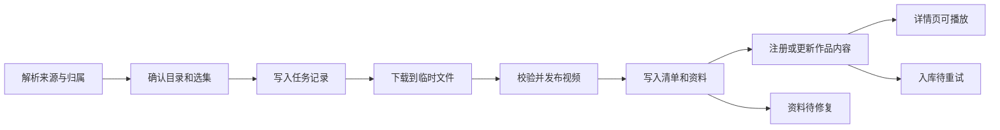

# 抱一使用体验审查与完整优化规划

日期：2026-09-08。状态：审查完成，建议方案待进入实施。本文包含产品设计、实施顺序和验收标准，本轮未修改产品功能。

**目标：** 用户以作品管理本地资源，下载一次即可得到结构完整、可直接入库的资源目录；同系列后续文件自动归入原作品。游戏封面支持正确的游戏身份和非 Steam 来源。

**架构方向：** 延续现有 `resource + video_meta + episode`，补充稳定的作品与来源映射、目录归属、文件资产及持久任务记录。下载、扫描与手动导入共用一个注册出口。游戏封面沿用 Chromium 网络和本地图片协议，增加官方来源与可诊断的处理阶段。

**技术范围：** Electron 37、Vue 3、Pinia、SQLite、现有扫描器、NFO/HTML 解析器和下载服务。首轮面向 Windows 桌面，不增加内置播放器、账号同步或通用插件市场。

**执行方式：** 后续实施按本文工作包逐项推进，每包完成相应场景验收；不把本轮文档完成理解为功能已实现。

## 1. 结论与定位

最需要优化的是“获取资源之后如何成为可用作品”的完整过程。现在的下载、识别、文件组织、作品展示分别存在，但用户仍须手动搬文件、重新扫描、核对分组、补资料。

建议把产品方向明确为：**以作品为单位管理一组可携带的本地资源。** 一个目录可以包含多个视频、简介、封面和字幕；用户看到一张作品卡片，在一个详情页里选集、补集和处理文件。

这一能力可以形成抱一的重点特色，但本次没有开展媒体管理产品的市场对比，不能认定为行业独有。真正需要验收的优势是用户少做了多少整理、重复识别和修正操作。

本次应完整覆盖三个目标：

1. 下载“妻NTR4”时，确定归属后自动创建“妻NTR”目录，附带真实取得的简介、封面及机器可读清单。
2. 此后下载同系列其他视频，跨页面、跨应用重启仍归入相同目录和相同作品，已有进度与手动资料保留。
3. 原神按游戏本体寻找封面；即使没有 Steam 条目，也能使用本地或官方来源，失败时能看清原因并继续操作。

## 2. 审查发现

证据类型：**实测**指独立资料启动成品包后的观察；**代码确认**指当前源码建立的行为；**用户反馈**指本轮提供的真实使用问题。详细位置和截图见 [审查证据记录](../../verification/2026-09-08-user-experience-review.md)。

| 优先级 | 发现与触发条件 | 对用户的影响 | 依据 | 优化去向 |
| --- | --- | --- | --- | --- |
| P0 | 单集和系列下载只保存视频，不写简介、封面，不自动入库 | 下载结束后还要自己建目录、整理、扫描和核对 | 用户反馈、代码确认 | W3、W4 |
| P0 | 系列保存到当次选择的目录，没有持久的作品目录映射 | 后补一集容易放错位置，重启后不能自动沿用系列归属 | 代码确认 | W2、W3 |
| P0 | 游戏远程候选图被成品页面 CSP 拦截 | 搜到封面也看不到，用户无法挑选；容易误判为网络故障 | 实测、代码确认 | W1 |
| P0 | 游戏查询直接使用已识别名称；没有本体身份校正流程，Steam 为主源 | “原神客户端/启动器”可能用于搜索；原神缺乏默认替代来源 | 用户反馈、代码确认 | W1 |
| P0 | 名称未命中后退到目录名，并接受相关性很低的 Steam 候选 | 本次共用 `media` 目录的原神样本返回无关产品封面，错图风险高 | 实测、代码确认 | W1 |
| P1 | 单集下载、系列下载各占常驻面板，并排在季集前面 | 960×640 下季集标题起点约 y=843，选集需先滚过两个下载区 | 实测 | W5 |
| P1 | 本地季集与远程下载清单各自独立；作品仅存一个 Hanime 编号 | 已有哪几集、可下哪几集、下载后新增哪几集不在同一处呈现 | 代码确认 | W2、W4、W5 |
| P1 | `collection_name` 只是虚拟筛选；目录、系列、分组没有明确的操作边界 | 改“分组”不会产生用户期待的落盘归档效果 | 实测、代码确认 | W2、W5、W7 |
| P1 | 单集只有一个文件路径，季集强依赖数字季号/集号 | 上下卷、番外、课程章节和同集多版本不能完整表达 | 代码确认 | W2、W5 |
| P1 | 有路径就算“已有文件”，实际文件已移走仍成为播放目标 | 显示缺 1 集，实际还有另一个已丢失文件；界面仍提示可以播放它 | 实测、代码确认 | W5、W7 |
| P1 | 加影视和加游戏在无 AI 配置时被拦截 | 即使已有元数据或愿意手动填名，也不能直接完成本地注册 | 代码确认 | W4、W6 |
| P1 | 下载任务跨应用重启不保留；任务面板主要用于读日志 | 无法从中断处找到待处理作品、直接重试或处理入库失败 | 代码确认 | W6 |
| P1 | 游戏候选探测吞掉错误，缓存失效无破图降级；替换前先清旧图 | 网络失败被当作未匹配；换图失败可能使原封面也不可用 | 实测、代码确认 | W1 |
| P1 | 游戏与影视扫描直接落库，缺乏面向结果的纠错清单 | 用户要靠识别日志判断哪里错，而不是直接修正错项 | 代码确认 | W6、W7 |
| P2 | 关键状态使用低对比文字，部分动作只在悬停时出现 | 缺文件、当前状态不易扫描，键盘使用和高缩放体验较弱 | 实测、样式计算 | W5、W6 |

P0 表示首个优化版本必须交付，P1 表示完整体验闭环所需，P2 表示后续增强。此处是产品实施优先级，不表示发现了数据泄露事件。

当前值得保留的能力：作品与季集已有基础模型；支持混合目录按作品拆分；重扫已保护视频手工字段和观看记录；下载已有临时文件发布与不覆盖保护；任务中心已有进度日志；视频海报已有本地缓存与失败占位。本轮方案建立在这些能力之上。

## 3. 方案选择

| 方案 | 收益 | 限制 | 建议 |
| --- | --- | --- | --- |
| A. 只改下载目录和文件名 | 改动较少，立刻减轻手动建目录 | 系列身份、资料、入库和界面继续割裂；无法可靠补集 | 可作为开发中的局部验证，不单独作为最终交付 |
| B. 作品目录 + 结构化资料 + 统一注册 + 多视频详情 | 覆盖本轮诉求，沿用现有作品/季集结构，可逐包交付 | 需要数据迁移和下载事务恢复设计 | **推荐** |
| C. 全品类统一成通用资源图谱并更换媒体核心 | 长远自由度高 | 软件、游戏、影视同时承担迁移成本，当前收益不成比例 | 暂不采用 |

本轮以 B 为主。游戏封面修复可以独立先交付；影视须以“自动归档、资料保存、自动注册、界面可用”一起验收，不能只交付创建文件夹。

## 4. 作品、视频、文件夹和分组

### 4.1 用户看到的对象

| 对象 | 定义 | 示例 |
| --- | --- | --- |
| 作品 | 共用核心介绍、封面与内容列表的管理单位 | 妻NTR、某一课程、某部电影 |
| 内容项 | 作品内可单独打开、标记或下载的单元 | 第 4 集、上卷、番外、课程第二讲 |
| 文件 | 内容项对应的本地视频；也可以是字幕、封面等附件 | 第 4 集的 1080p/720p 两个版本 |
| 作品目录 | 某作品用于自动下载和资料保存的物理目录 | `影视库/妻NTR/` |
| 收藏分组 | 用户跨作品组织的虚拟集合 | 暑假观看清单、学习资料 |

“同一系列”需要区分：连续内容通常是一部作品内的多个内容项；共享世界观、名称前缀或同一制作方的独立作品不应自动合并。站点播放列表也可能是推荐列表，须验证成员关系。

影片仍可只有一个视频，详情页直接播放。无需让用户为了单文件经过额外的选集页。

### 4.2 自动归属顺序

1. 已确认的本地作品清单、既有来源编号映射、用户之前确定的归属。
2. 同来源稳定的系列编号，或可信的系列播放列表与已知成员编号重合。
3. 本地 NFO 中一致的作品编号与作品信息。
4. 规范化标题、目录上下文、集号和其他元数据共同提出建议。

前两项高置信且无冲突时自动归入；标题推断和冲突项在下载确认区展示建议，用户可以改为另一个作品或新作品。决定存下来，下次同一来源命中后不再询问。

不能简单删除标题尾部数字得到系列名。“妻NTR4”在已核实的系列关系下归“妻NTR”；“三体2”“F1 2024”“1984”等不能靠删除数字合并。无证据时先保留原名，提示归属待确认。AI 可以提建议，目录选择与数据归并由确定性规则执行。

站点没有稳定系列编号时，为作品生成内部 UUID，并保存已确认成员编号与来源定位信息。某一集的 Hanime `videoCode` 仅作为来源入口，不能冒充系列的稳定 ID。内容项数变化、入口集被删除或站点标题变更，不重新创建作品。

### 4.3 数据演进

保留 `resource` 作为作品和游戏的已有身份，逐项扩展影视私有层：

| 模块/数据 | 增量职责 |
| --- | --- |
| `video_meta` | 作品展示类型、目录管理状态、清单版本；旧字段继续兼容读取 |
| `episode` | 稳定内容项 ID、展示标题、显示序号、排序及观看记录；非季播内容允许没有真实季号 |
| `video_sources`，新增 | 来源、作用范围、外部编号、作品/内容项对应关系、确认依据；作品与单集来源分开 |
| `video_directories`，新增 | 库根目录、作品相对目录、稳定清单 ID；一个作品一个默认下载目录，外部散落文件可继续引用 |
| `video_assets`，新增 | 文件路径、大小、角色、画质、可用性、检查时间及所属作品 |
| `video_episode_assets`，新增 | 内容项和视频文件对应；支持同集多版本、一个文件含多集的既有情况 |
| `video_download_jobs/items`，新增 | 请求、选集、目标作品、实际保存路径、下载/资料/注册阶段及重试结果 |

旧 `episode.path` 和电影 `parts` 在迁移期保留兼容投影，显示默认视频路径；新文件资产记录才负责表达多文件。真实编号仍保证同作品季集不重复；无季号的内容以内容项 UUID、来源 ID 和排序区分，不编造 S01 来凑约束。迁移时以数据库的实际版本为基准追加版本号，不预先假定固定版本。

不把所有类别都改为这一套新表。游戏继续使用 `game_meta`，身份、封面来源及失败状态采用该模块现有风格保存。

## 5. 自动目录与随附资料

### 5.1 默认落盘形态

下面展示一个已确认系列的结果。文件名中的画质是示例，最终保持实际获得的画质。

```text
影视库/
  妻NTR/
    baoyi.json
    简介.md
    poster.jpg
    妻NTR4 [1080p].mp4
    妻NTR5 [1080p].mp4
    .baoyi-incomplete/
```

`poster.jpg` 仅在实际获得 JPEG 时使用；PNG/WebP 保持真实扩展名，清单记录最终文件名。`.baoyi-incomplete/` 仅在有未完成文件时存在，扫描不将其中内容视为可播放视频。

确有可靠季号时可写 `Season 01/`，按作品来源和用户选择启用。上下卷、短系列默认平铺，避免一集一层目录。标准 NFO 可作为兼容导出项；抱一自己读取 `baoyi.json`，不依靠给所有资源伪造电视剧类型来注册。

### 5.2 目录规则

- 首次选定下载库根目录后持久记忆。下载确认区展示“库根目录 > 作品目录 > 本次文件”，可以直接修改归属与目标库。
- 后补同系列自动解析到已绑定的作品目录；同时从单集和系列入口下载也共用这一规则。
- 目录显示名与作品身份分离。只改作品标题时不自动搬动磁盘目录，明确的“整理目录”操作才同步改名。
- 同名目录无对应清单时，先检查其中已有资源是否一致。相同则绑定，不同则展示冲突；不能直接认作同系列。不同作品同名默认补充年份或短 ID。
- Windows 非法字符、保留名、大小写等价、路径长度须在确认时校验；规范化之后重名同样处理，不能静默覆盖。
- 已有内容按来源编号和文件记录判断重复，文件名相同仅是冲突线索。文件存在且已校验时可直接跳过；同一集另一画质默认作为版本，不能取代已有文件。
- 默认下载目录不存在时，区分“已迁移”“离线磁盘”和“未曾创建”。离线磁盘不自动退回系统下载目录；提供重连、重新定位或明确选择新库。
- 可选“另存到其他目录”作为明确操作；成功后用户决定是否变更默认归属。不能由上一次任意保存位置覆盖整个系列设置。

### 5.3 资料契约

`baoyi.json` 是可恢复的资源包清单，使用 UTF-8、带 `schema_version`。至少包含稳定作品/内容项 ID、作品名及别名、简介及原文、分类标签、来源页和外部编号、排序、实际文件相对路径、画质、大小、封面相对路径、资料来源和取得时间。

资源包不保存 API Key、Cookie、一次性直链和本机用户名路径。作品目录中的引用采用相对路径；导入时校验路径不得逃出授权目录。链接、字幕、封面和清单中的文件各有角色，不能把图片当作视频条目注册。

`简介.md` 让用户在文件管理器里直接了解作品，内容为作品标题、简介、来源、当前已保存内容列表。保留来源原文；中文译文有则另列，没有译文时不阻止保存，也不编造内容。

数据优先级：用户确认/手工修改 > 本作品已有可信清单 > 当前确定的来源事实 > 标题推断。每个可改字段保留来源和手工保护状态，不能因新下一集就覆盖整部作品的用户封面或笔记。

资料同步采用版本和状态判断，不能仅比较操作系统文件时间。库内编辑先落库，再更新本应用维护的清单；失败显示“资料待同步”。检测到用户在磁盘上改过简介或海报时，保留原文件并展示冲突，不反复回写覆盖。未知清单新版本以只读兼容或人工导入方式处理，不用旧结构重写。

资料和视频分别记录结果：封面没取到时，保留视频及已取到的简介，显示“封面待补全”，可以只重试封面。最终完成条件为“已保存视频、已注册内容、已保存可获得的资料，缺项明确”。

### 5.4 崩溃与中断恢复

文件系统与 SQLite 不能组成一个真正的跨系统事务，因此使用持久任务记录协调阶段：



每一集成功后分别提交，批次中其他集失败不回滚已保存内容。重启扫描任务记录和清单，恢复“已保存但尚未注册”这一阶段，不能重复下载。重试注册也不能创建第二张作品卡片。

首轮提供批次恢复、跳过已完成集、重试失败阶段。HTTP 字节级续传另列增强：只有来源支持 Range 且 ETag/Last-Modified 等验证成立才续传，否则重新下载当前未完成文件，已完成集仍保留。界面据实际能力区分“取消”“重试”和“继续”，不把重新下载写成断点续传。

## 6. 下载、导入和注册的目标流程

### 6.1 从链接开始

首页新增菜单提供“添加本地目录”“添加本地文件”“添加下载链接”，保留现有模块入口。链接入口首先支持当前已有的 Hanime 来源，不暗示任意站点都可下载。

新链接在主进程校验和解析，不要求用户先有一个已识别的本地视频。解析结果先作为下载草稿，明确显示作品、来源、选集、目录、画质与资料概况；确认开始后写任务。至少一个视频保存成功后创建/更新本地作品。解析失败或取消草稿不产生空作品卡片。

已有作品内点击下载时，优先带入其归属；从任意同系列单集链接开始也通过来源关系找到该作品。由服务层校验所选内容属于已解析目录，不能让渲染端提交任意文件路径或信任未验证编号。

### 6.2 下载确认

使用一个下载面板，按当前作品展示来源内容列表。单集下载即只选一项，整部下载即多选，取消两个长期并存的“单集/系列”面板。

内容行显示“本地已有”“可下载”“已排队”“处理中”“失败”“版本不同”。默认勾选已知缺失且可下载的项，用户可以全选、清空或选择单项。未解析来源总数时显示“已发现 N 项”，不能把本地数量写成全系列总集数。

画质选择采用已有下拉选项，提前显示回退策略。默认允许使用最高可用画质并明确提示回退；用户也可选择“没有目标画质则跳过”。磁盘空间未知时如实显示，能取得预估大小时与可用空间一起校验。

开始按钮使用“下载并入库”；自动归档与自动入库为默认行为，提供明确的“仅保存文件”选项以兼容特殊需要。不把“重新解析”等内部准备步骤作为每次操作的强制人工环节，来源过期时由任务刷新一次并反馈。

### 6.3 本地导入

按 `baoyi.json -> 标准 NFO/本地封面 -> 文件与目录信息 -> 可选联网补全` 处理。有效清单的目录直接注册，不调用 AI；可靠 NFO 走确定性读取。资料不足时允许填写名称后先入库，再异步完善。

混合目录先呈现作品拆分预览，列出已有作品、将新增的作品和未确定归属的文件。高置信项可以批量通过；冲突项留在“待确认”中，成功项不被阻塞。

对于“妻NTR4、妻NTR5”位于同一已有目录的情况，来源映射或清单足够时直接更新同作品；只有文件名时给出归并建议。不要借此次重扫自动移动用户历史文件。

注册出口统一接收已核实的作品、内容项和文件资产，服务层完成幂等更新、观看记录保护和列表刷新。新增文件成功后，首页数量、详情可用项和任务结果一起更新。

## 7. 主界面与详情页

### 7.1 影视主界面

- 默认每部作品一张卡片，卡片显示封面、名称、已有视频数、观看状态和一个最需要处理的状态。
- 数量区分“作品数”“已有视频数”。已知来源清单为 6 项且本地 4 项时写“已有 4/6”；总数不确定时写“已有 4 个视频”。
- 同系列补集只更新同一张卡片，不新增独立卡片。搜索子集标题或文件名时返回所属作品并指出命中的内容项。
- 增加“待处理”入口，按缺封面、归属待确认、文件失联、下载失败、资料待同步筛选；用户可从此直接完成修复。
- 保留海报网格，并增加紧凑列表。列表适合课程、录屏和多版本资源，列出名称、内容数量、路径状态、最近新增内容和任务状态。
- 收藏分组仍保留为虚拟组织工具，文字改为“收藏分组”；物理目录在作品位置中管理。更改两者的结果在对应控件处明确反馈。
- 保留现有里番可见性规则；新下载、任务标题、缺项计数与搜索结果同样遵守当前隐藏设置，不能从新入口绕过。
- 返回作品列表后保留搜索、过滤、排序、滚动位置与选择；提供按“最近新增内容”排序，补一集后能容易找到原作品。

### 7.2 作品详情

默认进入阅读和使用状态，编辑资料由“编辑资料”动作进入。页面优先顺序为：紧凑作品概览、主操作、内容列表、简介与附件；技术属性和来源详情按需展开。

```text
返回    作品名                                  播放所选   下载   更多
封面    简介摘要 / 已有数量 / 最近打开 / 目录状态

视频 4    简介与资料    附件
-------------------------------------------------------------
状态      名称/集号      画质/版本      文件状态       操作
已看      第 1 集       1080p         可用           播放
未看      第 4 集       1080p         可用           播放
未下载    第 5 集       1080p         来源可用       下载
失联      番外          720p          文件未找到     重新定位
```

布局要求：1280×900 至少出现 5 条可用内容行；960×640 至少出现 3 条或完整的空/错误状态。单视频作品首屏有播放、位置和简介，不空置季集表。上述数量是下阶段验收目标，不是本轮实测结果。

顶部保留播放、下载、打开目录和一个更多菜单。TMDB、豆瓣、来源链接、重新识别、归档、移除进入相应菜单；使用 Lucide 图标、可访问名称与工具提示，减少整个顶栏换行挤占内容。页面切换不把操作条遮在目标列表之上。

内容列表按有意义的编号、名称和来源次序展示：有季号则分季；只有上下卷、番外或章节名就照原名展示；允许用户调整排序并保护该调整。不要为了“一详情多个视频”把电影分卷、同集画质版本和不同内容混成同一级。

同一内容有多个文件时显示版本选择，默认文件明确可见；字幕和额外文件在相应内容下关联。打开文件夹、重新定位和移除提供内容项级操作；移除记录与删除磁盘文件明确区分。

观看状态与本地持有状态相互独立。文件暂时离线不取消已看记录，也允许用户记录在外部看过的内容。外部播放器目前不回传准确秒级进度，主按钮写清“播放第 X 集/上次打开”，不能承诺精确续播。

文件可用性在详情加载、库校验与播放前检查，区分“未下载”“文件丢失”“磁盘离线”“检查中”。检查结果带时间；不能把非空路径直接当作存在，也不能在暂时离线时删掉旧路径。

### 7.3 可用性细节

状态至少同时有文字或图标，不能只依赖颜色。正常说明文字对比度达到 4.5:1；提高缺文件、失败和次要信息的可读性。本次样式计算中浅色 `--text-faint` 对白色为 2.54:1，黄色警告文字对白色为 1.67:1，需要调整。

鼠标悬停可增加快捷操作，但播放、补封面、下载和修复不能只有悬停入口；键盘 Tab 有可见焦点，Enter/Space 可执行，Esc 可关闭面板并返回触发位置。批量操作反馈成功数、失败数和未处理数，支持只重试失败项。

长标题、中文目录与多版本标签可以换行；完整标题和路径有可见展开/复制操作。窗口缩小时先折叠次要列，避免无限压窄主内容。不以更换主题或装饰风格作为此次优化目标。

## 8. 原神与游戏封面方案

### 8.1 将游戏身份与启动方式分开

`resource.name_zh/name_en` 表达游戏本体；启动路径和启动参数仍表达如何运行。原神可以通过启动器启动，但不能因此把游戏身份改成 HoYoPlay。一个启动器承载多个游戏时，必须区分作品归属。

在用户所选游戏目录内，优先读取游戏安装配置、已知产品 ID、真实主程序信息和本地说明；主程序名仅作为线索。`YuanShen`、`Genshin Impact` 等由核验过的别名映射关联，不能凭通用 `launcher.exe` 自动断定原神。

详情的封面面板显示“当前匹配：原神”，允许改搜索关键词、选择正确作品或绑定来源 ID。改封面查询词不要求修改作品显示名。已有错误名称的条目提供“校正识别”，保留原 ID、游玩记录、存档、用户关联文件和当前启动目标。

### 8.2 来源选择

| 顺序/来源 | 用途 | 配置与网络 | 本次核查 |
| --- | --- | --- | --- |
| 1. 本地 `poster/cover/folder` 图片、资源清单和已验证缓存 | 绿色资源优先；可以完全离线 | 无账号、无代理 | 当前影视已有部分能力；游戏需补自动发现与关联规则 |
| 2. 已核验的官方作品来源 | 原神等非 Steam 游戏的默认替代方式 | 已验证的米哈游国内页面无需 API Key；是否可达由实际连接诊断判断 | 原神官网、官方启动器页均 200；启动器配置中原神关联的两张 PNG 均返回 206 与 `image/png` |
| 3. Steam 已绑定 appid/高相关游戏候选 | Steam 游戏封面来源 | 商店搜索无本应用额外密钥；网络因地区环境不同 | Portal 搜索和封面保存成功，但预览被当前 CSP 拦截 |
| 4. SteamGridDB | 补充非 Steam、替代构图和尺寸 | 可选配置；API 要求 Bearer 密钥，不能作为零配置默认项 | 官方 OpenAPI 已验证认证和游戏名称搜索接口；本次未持密钥调用图库 |
| 5. 用户启用的图片搜索 | 未收录作品的补充候选 | 现有 Bing/SearXNG 可返回图片；并非所有搜索服务商都支持 | 代码已确认存在此支路，不是“只有 Steam” |
| 6. 手动选图与游戏图标占位 | 来源失败时仍可使用 | 完全本地 | 手动选图已有；需补解码校验与不丢旧图的替换流程 |

IGDB 本轮不列为默认方案：官方文档在本环境返回 403 验证页，未完成可用性核查。未来如纳入，以正式 API 授权条件和本机连通性为准，不将未验证服务写成现成可用能力。

官方图片方案先落地原神这一小范围样本。使用经过核验的“产品标识 -> 官方页面/资源”映射；维护来源版本和失效刷新路径。当前页面配置属于公开网页发布资源，不是承诺长期兼容的公开封面 API，不能把此次哈希图片地址当作永远不变的接口。

本次核查确认的是来源关联、HTTP 状态和图片类型，尚未完成这些官方图片的最终封面构图验收。实施时要检查解码尺寸与视觉内容，标题标识、横幅和游戏图标分别按类型呈现；横图默认完整显示或由用户确认裁切，不能为了凑 2:3 把主要内容裁掉。

### 8.3 封面处理管线

统一为“确认作品 -> 查询候选 -> 下载并验证预览 -> 选择 -> 提交本地封面”。候选预览由主进程缓存后通过本地 `baoyi://` 返回；用已有本地协议体系解决成品包远程图片阻断，并使预览与最终保存经过一致的网络和图片校验。

每张候选带作品名称、来源、尺寸和可用状态。预览坏了就显示单张错误与重试，不能仍按可选成功图片处理。来源只返回低相关结果时显示“未找到可靠匹配”，允许修改词或切换来源；不会自动采用同名相似作品。

图片须验证响应体上限、实际可解码及最小有效尺寸。替换采用新文件验证、原子发布、更新引用、最后清旧文件的顺序。失败保留原封面；并发结果不能盖掉用户后来选的图。来源 URL、来源游戏 ID、更新时间分别持久保存，才能恢复丢失缓存。

失败至少分为：身份未确认、来源未收录、名称未命中、网络不可达、验证/限流、候选图片失效、图片解码失败、本地保存失败。面板内给出对应操作：改匹配、换来源、重试该阶段、重建缓存、选本地图。

游戏主页新增“补全封面”，面向当前筛选结果或用户选中项；先告知待处理数量，再逐条显示结果。不能只能逐个进入详情把图片补齐。封面查询和补全纳入任务中心。

### 8.4 关于代理

代理只能影响网络可达性，不能让 Steam 拥有未收录的游戏，也不能绕过应用自己拦截图片的 CSP。

当前设置中的代理作用于 Hanime 专用会话；游戏封面走默认 Chromium 网络，读取系统网络设置。因此“在抱一里填了代理”目前不等于“游戏封面也用了这个代理”。

推荐按来源记录“跟随系统/直连/指定代理”，默认选择匹配其用途的方式。原神官方国内来源优先直连；其他来源由实际探测决定。诊断显示当前来源、连接方式和失败阶段，用户无需猜测代理是否生效。保留 Hanime 验证会话的 Cookie 隔离，不将验证资料带给游戏图片来源。

本次 Node 请求没有设置应用级 HTTP 代理；官方页面和关联图片均可访问。但无法排除机器透明路由或 VPN，因此该结果是当前环境的可行性证据，不是对全部国内网络的保证。

## 9. 任务、识别结果与设置

任务中心从“日志入口”扩展为处理入口：任务关联作品和目录，支持打开详情、定位文件、取消、重新解析、只重试失败集、只补资料、只重试入库。任务仍可提供详细日志，但一般用户应能在结果摘要里完成下一步。

任务持久化的重点是用户已确认的下载意图和失败恢复信息。重启后将未完成任务标为“已中断”，展示已完成部分和恢复动作；不能凭界面加载重新启动大批下载。排队与并发分开：允许多作品排队，首轮继续采用一个视频传输并发，降低网络争用和实现风险。

扫描结果显示新增、更新、跳过、失败和待确认项，各有原因。用户能从错项直接改归属、名称或来源匹配；失败项重试不用重扫整库。保留软件已有确认流程，游戏和影视增加相应结果处理，不强行重写三个模块的全部扫描逻辑。

设置增加“下载与存储”和明确的“资料来源”配置：默认库目录、自动归档/入库、画质回退、来源网络、可选图库凭据。日常动作直接在当前页面执行，配置问题跳到具体设置项，返回后保留未完成操作。

所有会等待的动作有加载、取消或继续浏览能力。页面内错误长期保留至处理，Toast 只做短反馈；不得让“10 个任务中 1 个失败”只显示一句“完成”或把整个批次描述为全部失败。

## 10. 历史数据与文件迁移

迁移先检查当前数据库和资源路径，创建数据库备份及操作清单。默认只补齐新表、来源信息和引用关系，不在版本升级时搬动现有文件。

历史作品 ID、集 ID、观看状态、用户资料保护、收藏分组、归档状态和封面全部保留。单文件条目仍可用；迁入多视频作品时显式显示保留的主作品及内容归属。

“整理已有视频”单独提供预览：建议作品、源文件、目标目录、同名冲突、资料影响。用户确认后才执行；支持仅逻辑合并，或逻辑合并并整理磁盘。虚拟收藏分组不能直接当作物理搬迁依据。

同卷移动按文件发布语义操作；跨卷先复制校验，再切换库引用，最后处理源文件。保留操作日志与回退信息。任何一集失败仅标记该集，不能删掉整部作品的旧记录。对已存在同名目标不覆盖，对读不到的离线库不判空。

把一个文件夹复制到其他机器或移动盘后，读取清单相对路径可以恢复作品及元数据。当前库已经有相同清单 UUID 时，区分“原目录迁移”“第二份副本”，提示绑定或创建副本；不能静默把旧库路径指向另一份内容。

第一版不自动跨机器合并观看进度。观看历史的备份/恢复采用明确的数据导出导入；资源包默认承载作品、内容和文件资料，避免用副本中的旧观看状态覆盖正在使用的记录。

## 11. 实施工作包

每包先锁定可复现的失败/目标场景，再实现，再执行对应验证。涉及数据库、目录迁移、恢复和外部协议的包必须有真实边界测试；纯文字和布局调整以界面走查验收，不堆积镜像实现的测试。

### W1. 游戏封面可靠性与原神替代来源，P0

修改 `electron/kinds/game/covers.ts`、`service.ts`、`schema.ts`、`db.ts`、`prompts.ts`、`tools.ts`，以及 `electron/ipc/handlers.ts`、`electron/main.ts`、`electron/preload.ts`、游戏 Home/Detail/GameCard 和共享类型。新增 `electron/kinds/game/identity.ts`、`cover-providers.ts`，只抽取本次新增的身份和来源规则。

- [ ] 在成品包中固定“Portal 有候选但预览被拦”“缓存不存在”“替换失败”的回归场景。
- [ ] 完成候选本地缓存、可解码校验、保留旧图的替换和图片错误占位。
- [ ] 增加身份确认与独立搜索词，限制无关名称/目录回退；保留原启动路径及记录。
- [ ] 为已确认原神绑定官方来源，覆盖本地图优先、官网资源失效和手动选择。
- [ ] 输出分阶段错误和当前网络方式，纳入封面任务；提供当前列表批量补图。
- [ ] 运行独立 `verify-game-covers` 服务检查及成品包原神/Portal 界面检查。

验收：原神无需 Steam 归属或图库密钥即可使用已核验的官方/本地图片；Portal 所有成功候选能显示；网络或换图失败不丢旧封面。官方图片不是竖版时按真实构图显示。

### W2. 作品来源、目录与内容资产，P0 基础

修改影视 `schema.ts`、`db.ts`、`scanner.ts`、`facts.ts`、共享 `src/types/index.ts` 和数据导出入口；新增 `electron/kinds/video/identity.ts`、`library.ts`。

- [ ] 用旧库副本验证升级，涵盖电影、多季、上下卷、同集多画质与一文件多集。
- [ ] 建立稳定作品/单集来源映射及默认目录绑定，落实大小写与重复约束。
- [ ] 扩展内容项展示序号与文件资产关联，旧 path/parts 兼容投影可用。
- [ ] 增加确定归属与待确认归属的返回形状；实现重复注册和来源变化的幂等规则。
- [ ] 扩展导出/恢复对新数据的覆盖，验证旧 ID、进度和用户保护字段不变。

验收：从第 4 集起步后补第 1、5 集仍只有一个作品，编号变化不改变身份；同集两个版本都可定位，回滚恢复不丢数据。

### W3. 自动归档与资源包，P0

修改 `electron/kinds/video/download/service.ts`、`sources.ts`、`transfer.ts`、`electron/ipc/video-download.ts`、`src/types/video-download.ts`；新增 `electron/kinds/video/bundle.ts`。

- [ ] 建立根目录及作品子目录预览，覆盖已有绑定、同名目录、非法名、长路径和离线磁盘。
- [ ] 从来源解析结果和已存资料取得简介、封面、成员信息，来源 ID 与临时直链分开。
- [ ] 按统一目录保存单集和多选下载，并发布清单、简介及实际封面。
- [ ] 区分资料失败和视频失败，保留完整文件与可重试的缺项；忽略临时下载文件。
- [ ] 覆盖首次下载、重启补集、同名不同作品、两入口同时请求同系列的归属一致性。

验收：“妻NTR4”产生“妻NTR”目录和有效随附资料；下次同系列自动归入；资料未获得时可见缺项，内容不伪造、不覆盖用户文件。

### W4. 统一注册和本地直接导入，P0

修改 `electron/kinds/video/service.ts`、`tools.ts`、`facts.ts`、`scanner.ts`、`db.ts`、影视 store 和 IPC；新增 `electron/kinds/video/registration.ts`。

- [ ] 让下载、清单导入与已有识别统一调用注册出口，合并内容项并保护用户数据。
- [ ] 有效资源包和 NFO 可以跳过 AI；不完整资料允许手动注册后补全。
- [ ] 下载完成发布资源变更，详情、主界面和任务读取同一个最终状态。
- [ ] 验证文件已落盘但资料/数据库失败的重试，不重新传输、不新增重复作品。
- [ ] 在独立空库关闭网络和 AI，导入 W3 产物，核对标题、封面、简介、内容顺序和路径。

验收：下载后即可进入原作品打开新增视频；复制资源目录到另一个空库可离线注册。

### W5. 多视频首页与详情，P1，随影视闭环交付

修改影视 Home/Detail、VideoCard、Sidebar、store、`useVideoDownload.ts`、`useVideoSeriesDownload.ts`，整合 SingleDownload/SeriesDownload；新增 `VideoItems.vue` 和统一 `DownloadPanel.vue`，沿用 Lucide。

- [ ] 首页以作品计数，增加已有视频数、最近新增内容和待处理筛选，搜索子项能定位所属作品。
- [ ] 详情改为紧凑概览和视频优先布局；单文件作品保留直接播放。
- [ ] 统一来源清单与本地内容行，支持默认选缺项、版本选择、上下卷/番外和逐项修复。
- [ ] 重要动作可用键盘访问；长标题和最小窗口下内容前移、操作条不遮挡目标。
- [ ] 成品包测 1280×900、960×640，至少验证首屏可见行数、返回位置、深浅主题与系统缩放。

验收：用户不翻日志或文件管理器就能判断“已有、缺失、在下载、可播放”，补一集只更新同一作品。

### W6. 持久任务、链接入口和结果处理，P1

修改任务中心、`useTaskCenter.ts`、`useMediaScan.ts`、设置、相关 IPC 与两类下载 composable；新增 `electron/kinds/video/download/jobs.ts`，维护主进程任务记录。

- [ ] 首页可从支持的链接创建下载草稿，取消不产生空作品；设置问题返回后保留草稿。
- [ ] 用户可排队多个作品，传输先维持串行，取消与切页不破坏已完成集。
- [ ] 记录任务阶段，重启显示已中断和已完成部分，提供明确恢复动作。
- [ ] 支持打开作品、只重试失败集、补资料和重试入库；界面区分部分完成。
- [ ] 扫描结果显示新增/更新/跳过/待确认/失败，可从具体条目修正；游戏本地手动注册可无 AI 完成。
- [ ] 配置区分别展示下载目录、资料来源和网络方式；长任务的阶段失败纳入同一入口。

验收：下载第 3 集中断，重启后前 2 集仍在，用户只处理余下项；入库失败只重试入库；封面失败不需要重跑游戏识别。

### W7. 历史库整理与持续可用性，P1

新增 `electron/kinds/video/organize.ts` 和对应整理预览界面，接入影视数据库与文件资产校验。复用软件整理中适合的底层文件操作，影视归属规则留在影视模块。

- [ ] 输出历史资源的逻辑合并、物理整理建议及冲突清单，默认预览。
- [ ] 保留作品/内容历史，处理同名冲突、跨盘复制、磁盘离线和部分失败。
- [ ] 对作品加载和播放前的文件状态作有限检查，提供重新定位与目录变更绑定。
- [ ] 验证迁移回退、资源目录复制、重复清单 UUID 与导出恢复。

验收：已有散落同系列可整理成一个作品目录；中途失败仍能用原有资源，用户可查看变更并恢复。

### W8. 后续增强，P2

完成 W1-W7 之后，再按实际需求增加可靠的 HTTP 字节续传、可选 SteamGridDB、批量处理大库的虚拟列表/缩略图预算和更多发行商适配。HLS/DASH、自动追更、内置播放器、全品类通用资源图谱不作为本轮验收前提。

## 12. 排期与发布顺序

下表为一名熟悉当前项目的工程师的初步工作量区间，包含必要开发和专项验证；不含第三方验证等待、大规模历史库人工整理和未知网络异常。

| 阶段 | 内容 | 依赖 | 参考工作量 | 用户可检验的结果 |
| --- | --- | --- | --- | --- |
| R1 | W1 游戏封面修复与原神样本 | 可独立推进 | 3-5 人日 | 正确身份、官方/本地来源、可见候选、失败恢复 |
| R2 | W2-W4 作品目录与注册核心 | W2 先于 W3/W4 联调 | 7-11 人日 | 视频+资料自动归档，可直接/离线注册，补集无重复 |
| R3 | W5-W6 完整操作流程 | W2 契约确定后开发，依赖 R2 验收 | 5-8 人日 | 首页链接入口、视频优先详情、持久任务与结果处理 |
| R4 | W7、成品端到端复验和迁移演练 | R2/R3 | 4-6 人日 | 老库可整理、失联可恢复、打包版闭环成立 |

完整范围约 19-30 人日，属于规划估算，不是已承诺日期。W2 的迁移样本确认后复核估算。R2 可提供内部验证包；对用户宣称影视体验优化完成，至少必须通过 R3 的完整操作场景。

## 13. 场景验收

下面按用户操作验收，不能以单元检查全通过替代。成品包使用独立 profile 和可重建资料，正式测试可播性时采用真实、合法可访问的视频样本。

| 编号 | 场景 | 通过条件 |
| --- | --- | --- |
| A01 | 新用户先下载妻NTR4 | 一次确认作品/根目录后得到“妻NTR”目录、视频、真实简介与封面/明确缺项、清单和一张作品卡片 |
| A02 | 重启后从另一集链接补妻NTR5 | 不再选择作品目录，进入原文件夹、原详情，已有观看和手改资料不变 |
| A03 | 先下第 4 集，再补第 1 集 | 原作品 ID 不变，内容自然排序，没有“新作品”或重复集 |
| A04 | 标题尾数字属于作品名 | 不错误合并；依据不足时可以调整建议并记住决定 |
| A05 | 同系列 1080p/720p | 内容项只一条，两个版本保留且可分别打开，无覆盖 |
| A06 | 上下卷、番外、课程章节、一文件多集 | 展示真实标题/顺序；不强造季号，不丢文件关联 |
| A07 | 部分集已在本地 | 默认只选缺项，可改变选择；总数不确定时显示“已发现” |
| A08 | 封面失效或简介缺失 | 视频完成且可注册，缺项有重试入口；重试不重新下载视频 |
| A09 | 文件发布后数据库失败 | 文件保留，任务显示入库待重试；再次执行只产生一次注册 |
| A10 | 下载取消、断网或关闭应用 | 完成集保留，未完成项明确；重启可恢复，临时文件不出现在片库 |
| A11 | 多个作品同时排队 | UI 表达排队状态，依次执行；两个同系列请求保持同一归属 |
| A12 | 无 AI/无网导入完整资源包 | 标题、简介、封面、内容列表与相对路径恢复，不强制填写密钥 |
| A13 | 同名目录装着别的作品 | 展示冲突和新目录选择，不混入、不覆盖 |
| A14 | 跨盘、只读目录、路径过长或磁盘不足 | 开始前尽早提示实际问题；失败保留原资源，可换目标后继续 |
| A15 | 文件在资源管理器中移走或移动盘离线 | 状态区分失联/离线，播放前检查，有重新定位，观看历史保留 |
| A16 | 原神条目识别为启动器 | 可校正为原神身份而保留启动方式、存档和游玩记录；搜索不再使用启动器名 |
| A17 | 原神无 Steam 来源且未配置图库密钥 | 官方/本地途径可获得经视觉确认的图片，来源可见；失败可手选 |
| A18 | Portal 成品包选封面 | 成功候选均可预览，选择后本地图片可显示，控制台无 CSP 阻断 |
| A19 | 换封面失败、缓存丢失、并发返回 | 不丢原图或误覆盖新选择，坏缓存能发现并单独重建 |
| A20 | 没搜到、连不上、预览坏了 | 三类结果表达不同，可从相应阶段继续，任务中能找回 |
| A21 | 960×640 / 1280×900、长标题、键盘、高缩放 | 首屏内容目标达成，无文字遮挡；焦点可见，图标有名称；关键文本对比合格 |
| A22 | 隐藏里番后看主页、搜索、任务和计数 | 新入口与旧规则一致，不出现被隐藏的作品信息 |
| A23 | 老库迁移、物理整理一半失败、回退 | 原 ID、观看记录、封面和用户修改不丢；结果逐项可核对 |
| A24 | 复制作品目录到空库/已有同 ID 的库 | 空库可直接恢复；已有库识别副本冲突而不静默重绑 |

过程指标：高置信同系列后补视频不再询问归属目录；有效资源包导入为零 AI 调用；入库/资料重试为零视频重传；重复操作产生零重复作品、零无提示文件覆盖。耗时指标在统一样本上记录中位数与慢场景，不能承诺外网图片固定几秒内成功。

## 14. 实施前提与边界

本规划采用以下默认选择：一部作品默认一个受管理目录；自动归档与自动入库默认开启；已有库升级不自动搬文件；高置信归属自动执行，冲突项可确认；封面失败不会拖垮视频注册；外部播放器保持现状。

本轮未访问用户原神安装目录、未读正式片库来验证识别当时的输入，也未调用真实 LLM；“启动器名被识别成游戏名”的实际成因仍需在实施 W1 时用脱敏条目和所选安装目录复现。本轮已经验证当前查询策略和封面预览故障，不把上述未复现环节写成已定位的唯一原因。

本轮未进行真实站点整段视频下载、历史库迁移或产品代码修改。下一轮的完成标准是本文件中的操作场景在最终打包程序成立，而不是仅源码能编译。
